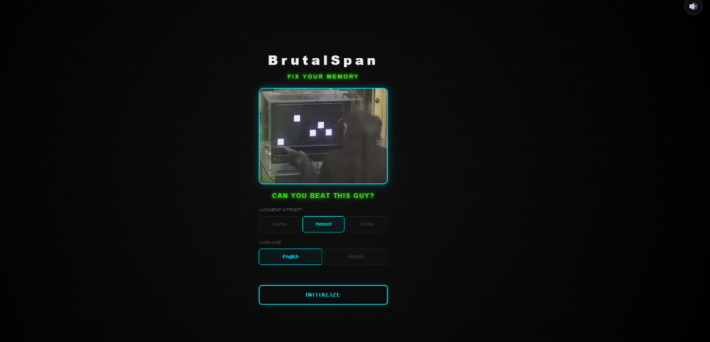
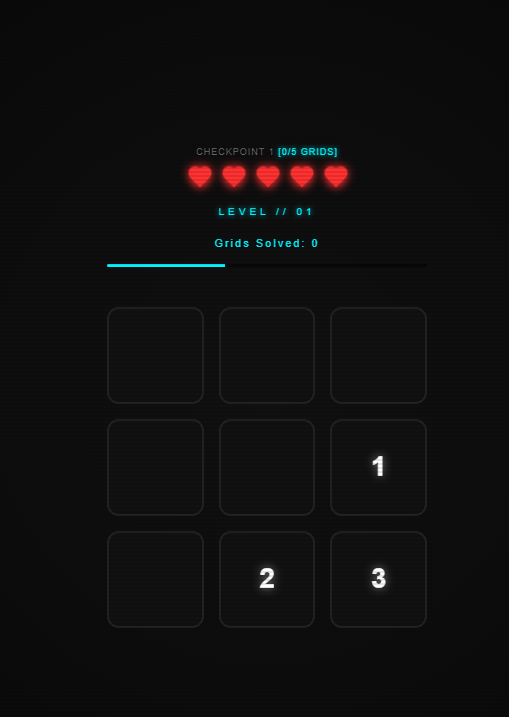
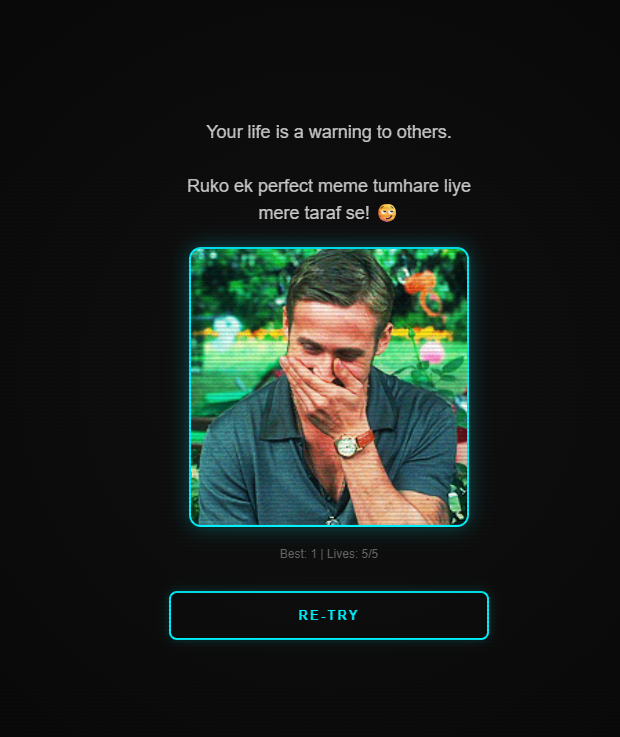
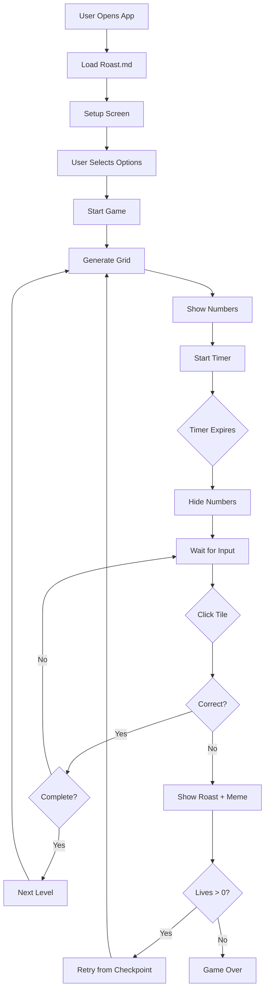

# BrutalSpan - Memory Roast Game

A neon-themed memory game that brutally roasts you when you fail! Features 380+ dynamic roasts in English and Hinglish, 50+ meme GIFs, and a savage difficulty progression system inspired by chimpanzee memory tests.

**🎮 [Play Live Demo](https://brutalspan.netlify.app)**

---

## Screenshots


*Configure your judgment intensity and language preference*


*Memorize the numbers before they disappear*


*Get roasted with savage messages and memes when you fail*

---

## Features
- 🎮 **Progressive Difficulty**: From 3 to 9 numbers with decreasing time limits
- 🔥 **380+ Dynamic Roasts**: Unique roasts from `src/data/Roast.md`
- 😂 **50+ Meme GIFs**: Visual feedback on failures
- 🌐 **Dual Language Support**: English & Hinglish
- 💀 **Intensity Levels**: Gentle, Honest, or Brutal
- ❤️ **Lifeline System**: 5 lives with checkpoint system
- 🎨 **Neon Cyberpunk Aesthetic**: Beautiful dark theme with glow effects
- 🔊 **Audio Feedback**: Background music & haptic feedback

---

## Technical Architecture

### Computer Science Perspective

BrutalSpan is a **client-side web application** built with vanilla JavaScript, demonstrating several CS concepts:

#### 1. **State Management**
The game uses a centralized state object to manage all game logic:

```javascript
let g = {
    cur: 1,           // Current level
    exp: 1,           // Expected next number
    data: [],         // 9-cell grid data
    state: 'IDLE',    // FSM: IDLE | REVEAL | INPUT | FAIL
    timer: null,      // Countdown timer reference
    lives: 5,         // Player lives
    checkpoint: 1,    // Current checkpoint
    usedRoasts: Set,  // Prevents roast repetition
    usedMemes: Set    // Prevents meme repetition
};
```

#### 2. **Finite State Machine (FSM)**
The game operates as a state machine with four states:
- **IDLE**: Setup screen
- **REVEAL**: Numbers are visible (timed)
- **INPUT**: Numbers hidden, awaiting player clicks
- **FAIL**: Wrong answer, show roast screen

State transitions:
```
IDLE → REVEAL (on start)
REVEAL → INPUT (after timer expires)
INPUT → REVEAL (correct sequence completed)
INPUT → FAIL (wrong number clicked)
FAIL → REVEAL (retry with checkpoint restore)
```

#### 3. **Algorithm: Number Placement**
Uses **Fisher-Yates shuffle** variant for random positioning:

```javascript
// Generate array [0,1,2,3,4,5,6,7,8]
let pos = [...Array(9).keys()];

// Shuffle using sort with random comparator
pos.sort(() => Math.random() - 0.5);

// Place n numbers in random positions
for (let i = 0; i < n; i++) {
    g.data[pos[i]] = i + 1;
}
```

#### 4. **Time Complexity Analysis**
- **Grid Rendering**: O(9) = O(1) - constant 9 tiles
- **Click Validation**: O(1) - direct array access
- **Roast Selection**: O(n) where n = roast pool size
- **State Update**: O(1) - simple variable assignments

#### 5. **Memory Management**
- **Data Structures**:
  - `Array` for grid data (fixed size: 9)
  - `Set` for tracking used roasts/memes (prevents duplicates)
  - `localStorage` for high score persistence

- **Memory Optimization**:
  - Reuses DOM elements instead of recreating
  - Clears unused roast/meme sets when pool exhausted
  - Uses CSS transforms for animations (GPU-accelerated)

#### 6. **Asynchronous Operations**
- **Fetch API**: Loads roast data from Markdown file
- **Timers**: `setTimeout()` for reveal countdown
- **Promises**: Async/await for file loading
- **Web Audio API**: Non-blocking sound generation

#### 7. **Event-Driven Architecture**
```
User Input → Event Handler → State Update → DOM Re-render
```

Example flow:
```
Click tile → tap(i) → Validate → Update state → render()
```

---

## How It Works: Game Logic Breakdown

### 1. **Initialization Phase**
```javascript
loadRoasts() → Parse Roast.md → Populate ROASTS object
```
- Fetches `src/data/Roast.md` via AJAX
- Parses sections: English roasts, Hinglish roasts, Meme URLs
- Stores in memory for instant access

### 2. **Level Generation**
**Dynamic Difficulty Scaling:**

| Grids Solved | Numbers Shown | Time Limit |
|--------------|---------------|------------|
| 0-4          | 3             | 5s         |
| 5-9          | 4             | 5s         |
| 10-14        | 5             | 4s         |
| 15-19        | 6             | 3s         |
| 20+          | 7-9           | 2s         |

**Algorithm:**
```javascript
function render() {
    // Calculate number count based on progress
    let n = calculateNumbers(g.gridsSolved);
    
    // Calculate time based on level
    let t = calculateTime(g.cur);
    
    // Randomly place numbers
    placenumbers(n);
    
    // Start countdown timer
    startTimer(t);
}
```

### 3. **Checkpoint System**
**Concept**: Save progress every 5 grids to allow retry without starting over

```
Checkpoint 1: Grids 0-4   → Reset to Level 1
Checkpoint 2: Grids 5-9   → Reset to saved level
Checkpoint 3: Grids 10-14 → Reset to saved level
Checkpoint 4: Grids 15-19 → Reset to saved level
Checkpoint 5: Grids 20-24 → Reset to saved level
```

**Implementation:**
```javascript
function getCheckpoint(gridsSolved) {
    if (gridsSolved < 5)  return { cp: 1, startLevel: 1 };
    if (gridsSolved < 10) return { cp: 2, startLevel: savedLevel };
    // ... etc
}
```

### 4. **Roast Selection Logic**
**Smart Roast System** to prevent repetition:

```javascript
// 1. Filter unused roasts
let availableRoasts = roastPool.filter(r => !g.usedRoasts.has(r));

// 2. Reset pool if exhausted
if (availableRoasts.length === 0) {
    g.usedRoasts.clear();
    availableRoasts = roastPool;
}

// 3. Random selection
let roast = availableRoasts[Math.floor(Math.random() * availableRoasts.length)];

// 4. Mark as used
g.usedRoasts.add(roast);
```

**Streak Modifier:**
- Failing 2+ times in a row adds "Again?" prefix
- Level 11+ strips emojis for cold seriousness

### 5. **Audio System**
**Web Audio API** for click sounds (no external files):

```javascript
function playClick() {
    const oscillator = audioContext.createOscillator();
    const gainNode = audioContext.createGain();
    
    oscillator.frequency.value = 800; // Frequency in Hz
    oscillator.type = 'sine';
    
    gainNode.gain.setValueAtTime(0.3, audioContext.currentTime);
    gainNode.gain.exponentialRampToValueAtTime(0.01, audioContext.currentTime + 0.1);
    
    oscillator.connect(gainNode);
    gainNode.connect(audioContext.destination);
    
    oscillator.start();
    oscillator.stop(audioContext.currentTime + 0.1);
}
```

### 6. **Lifeline System**
- Start with 5 lives
- Lose 1 life on each retry
- Game over at 0 lives
- Visual feedback with animated hearts

---

## Data Flow Diagram



---

## Project Structure
```
roast-game/
├── src/
│   ├── js/
│   │   └── roast-parser.js      # Roast parsing utilities
│   └── data/
│       └── Roast.md             # 380+ roasts database
├── assets/
│   ├── audio/
│   │   └── background-music.mp3 # Background soundtrack
│   └── video/
│       └── intro-video.mp4      # Chimpanzee memory test
├── screenshots/                 # App screenshots
│   ├── setup-screen.png
│   ├── gameplay.png
│   └── roast-screen.png
├── index.html                   # Main game (with lifelines)
├── game.html                    # Alternative version
├── netlify.toml                 # Deployment config
└── README.md
```

---

## Getting Started

### Play Locally
1. Clone this repository
   ```bash
   git clone https://github.com/princeyadav308/BrutalSpan.git
   cd BrutalSpan
   ```

2. Open `index.html` in a modern web browser
   ```bash
   # On Windows
   start index.html
   
   # On Mac
   open index.html
   
   # On Linux
   xdg-open index.html
   ```

3. No build process needed - it's pure HTML/CSS/JS!

### Deployment
This project is configured for Netlify deployment:
- Push to GitHub
- Connect your repository to Netlify
- It will auto-deploy from the root directory

---

## How to Play
1. **Choose Intensity**: Gentle (encouraging), Honest (realistic), or Brutal (savage)
2. **Select Language**: English or Hinglish
3. **Memorize Numbers**: Watch the grid carefully
4. **Click in Order**: Tap numbers 1, 2, 3... in sequence after they disappear
5. **Survive**: You have 5 lives across checkpoints
6. **Challenge Yourself**: Beat the chimpanzee's memory!

---

## Technical Stack

| Technology | Purpose |
|------------|---------|
| **HTML5** | Semantic structure |
| **CSS3** | Neon styling, animations, gradients |
| **Vanilla JavaScript** | Game logic, no frameworks |
| **Web Audio API** | Click sound synthesis |
| **Fetch API** | Async data loading |
| **localStorage** | High score persistence |
| **CSS Grid** | 3×3 tile layout |
| **CSS Animations** | Smooth transitions |

---

## Performance Optimizations

1. **GPU Acceleration**: Uses CSS `transform` instead of `top/left`
2. **Event Delegation**: Single event listener for all tiles
3. **Lazy Loading**: Roasts loaded once, cached in memory
4. **Set Data Structure**: O(1) lookup for used roasts
5. **Debouncing**: Prevents rapid-fire clicking
6. **Minimal Reflows**: Updates via classes, not inline styles

---

## Browser Compatibility
- ✅ Chrome 90+
- ✅ Firefox 88+
- ✅ Safari 14+
- ✅ Edge 90+
- ⚠️ IE not supported (uses modern ES6+ features)

---

## Contributing
Contributions are welcome! Areas for improvement:
- Add more roasts to `src/data/Roast.md`
- Implement leaderboard with backend
- Add sound effects variety
- Create progressive web app (PWA)
- Add dark/light theme toggle

---

## Credits
Created with ❤️ and savage roasts

Challenge inspired by chimpanzee memory tests - can you beat their incredible working memory?

---

## License
MIT License - Feel free to fork and modify!

---

**Ready to test your memory?** [Play Now](https://brutalspan.netlify.app) 🧠🔥
